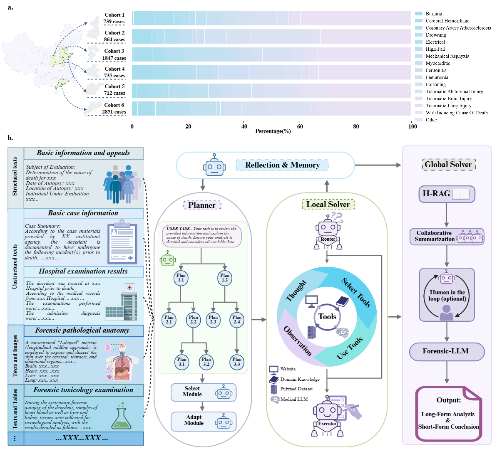
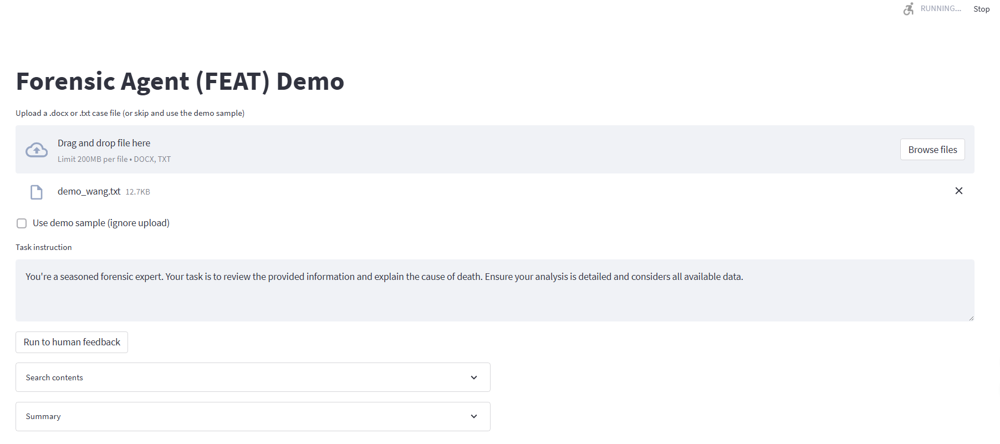
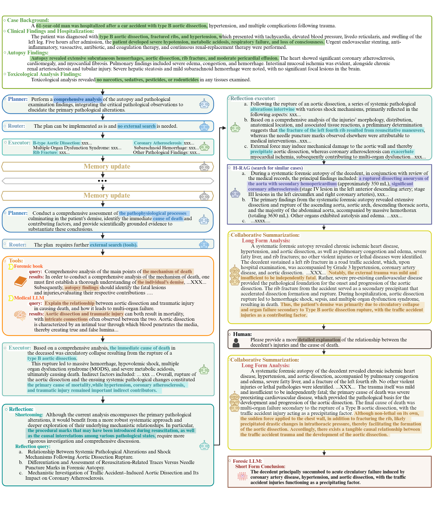

FEAT :monkey_face: 
===========
[](http://arxiv.org/abs/2508.07950)

**FEAT is a modular, multi-agent architecture for forensic cause-of-death analysis that transforms heterogeneous inputs into transparent, auditable conclusions.**
*A Planner* ingests case materials (basic demographics, pathological anatomy, toxicology, scene notes) and performs self-discovered task decomposition, sequencing subtasks and routing them to role-specific Local Solvers. 
*Local Solvers* apply tool-augmented ReAct reasoning to generate intermediate findings and rationales for their assigned domains (e.g., pathology, toxicology, clinical history).
*A Reflection & Memory module* monitors progress, critiques outputs, caches evidence, and iteratively refines hypotheses to reduce error propagation. 
*A Global Solver* then consolidates solver outputs using hierarchical retrieval-augmented generation over a curated Chinese-language medicolegal corpus, combined with locally fine-tuned LLMs, to synthesize a long-form analysis and a concise cause-of-death conclusion with evidence traceability. 

[中文](https://github.com/shenxiaochenn/FEAT/blob/master/README_zh.md) ｜ English

## FEAT: A Multi-Agent Forensic AI System with Domain-Adapted Large Language Model for Automated Cause-of-Death Analysis

<div align=center>

</div>

**Overview of the FEAT system and data.** (a) Category composition of the six evaluation cohorts (C1--C6). Stacked bars show the percentage distribution across cause-of-death categories (legend at right; cohort case counts labeled at left). (b) The system is: (1) FEAT ingests multi-source materials. (2) The Planner decomposes the case into a hierarchical plan and adapts it to the instance. (3) Local Solvers, coordinated by a Router, follow a ReAct cycle to generate evidence-grounded findings using resources such as a forensic textbook/vector store, PubMed retrieval, websites, and a medical LLM; an Executor synthesizes subtask results. (4) Reflection \& Memory maintains a dynamic case file, audits intermediate outputs for completeness and consistency, and triggers replanning when gaps or contradictions are detected---forming an iterative loop. (5) The Global Solver performs collaborative summarization and employs hierarchical retrieval-augmented generation to retrieve similar cases and authoritative references; with optional human-in-the-loop review, it invokes a Forensic-LLM to produce court-ready outputs: a long-form analysis and a short-form conclusion.

## 👀 Updates: 
* 15/08/2025: We are currently updating the code repository of FEAT.

## Installation:

**Pre-requisites**:
```bash
python 3.11+
CUDA 12.4
pip
ANACONDA
```
After activating the virtual environment, you can install specific package requirements as follows:

```bash
## first, you need install the LLaMA-Factory.
git clone --depth 1 https://github.com/hiyouga/LLaMA-Factory.git
cd LLaMA-Factory
pip install -e ".[torch,metrics]" --no-build-isolation
## second, install like langchain and langgraph
pip install -r requirements.txt
## 
```
## 🚀 Quick Start

<div align=center>

</div>

We have developed a web interface based on Streamlit, so that forensic pathologists can easily access it.
You can see [README.md](https://github.com/shenxiaochenn/FEAT/blob/master/Agent_streamlit/README.md).
And the only run 

```bash
streamlit run streamlit_app.py
```

You can now view your Streamlit app in your browser. This way, you can easily use FEAT and it will help you analyze forensic cases.

```bash
Network URL: xxxxxxxxxxxxx  
External URL: xxxxxxxxxxxxx
```
All you need to do is upload your information and then click on **"run to human feedback"**, which will start the preliminary analysis process. At this point, the system will interact with you. If you are satisfied with the result, it will generate the final long-format analysis and short-format conclusion. 
Note: All the contents can be downloaded to your local device and will be saved with the default name "report.txt".

Another way is that you can also use FEAT by entering commands in the terminal.

```bash
cd Agent
python  feat_human_multi_replan.py --data_path xxx  --out_path xxx  ## this will cost more money!
## or
python  feat_human_multi.py --data_path xxx  --out_path xxx
```

## 🔥 NOTE:

There are certain preparations that you must do!

1. You need to prepare some keys. This is essential!
 ```python
 os.environ["LANGCHAIN_TRACING_V2"]="true"
 os.environ["LANGCHAIN_ENDPOINT"]="https://api.smith.langchain.com"
 os.environ["LANGCHAIN_API_KEY"]="lsv2_xxxxxxxxx"
 os.environ["LANGCHAIN_PROJECT"]="xxxxxxxxx"
 os.environ["OPENAI_API_KEY"] = "sk-xxxxxxxxx"
 os.environ["OPENAI_BASE_URL"] = "https:xxxxxxxxx"
 os.environ["DEEPSEEK_API_KEY"] = "sk-xxxxxxxxx"
 os.environ["TAVILY_API_KEY"] = "tvly-xxxxxxxxx"  
```
2. We have deployed multiple local medical large-scale models, and you must successfully deploy them.

  ```bash
  cd  llama_factory
  sh deepseek.sh ### our finetuning Forensic LLM
  sh  baichuan.sh  ### medical knowlege model
  ... ## other tools model, if you need !
  ```

## 😁 Demo:

<div align=center>


 **An example to illustrate the working process of FEAT for autonomous cause-of-death analysis.** 
</div>


## 🙏 Acknowledgments
This code is developed on the top of [LangChain](https://github.com/langchain-ai/langchain), [LangGraph](https://github.com/langchain-ai/langgraph),[Langsmith](https://github.com/langchain-ai/langsmith-sdk) and [LLaMA-Factory](https://github.com/hiyouga/LLaMA-Factory).

## ✉️ Contact

Email: chunfeng.lian@xjtu.edu.cn, wzy218@xjtu.edu.cn,   and  shenxiaochen@stu.xjtu.edu.cn .  Any kind discussions are welcomed!

---

## 📖 Citation
If our work is useful for your research, please consider cite:
```bibtex
@article{shen2025feat,
  title={FEAT: A Multi-Agent Forensic AI System with Domain-Adapted Large Language Model for Automated Cause-of-Death Analysis},
  author={Shen, Chen and Zhang, Wanqing and Li, Kehan and Huang, Erwen and Bi, Haitao and Fan, Aiying and Shen, Yiwen and Dong, Hongmei and Zhang, Ji and Shao, Yuming and others},
  journal={arXiv preprint arXiv:2508.0795},
  year={2025},
}

```
