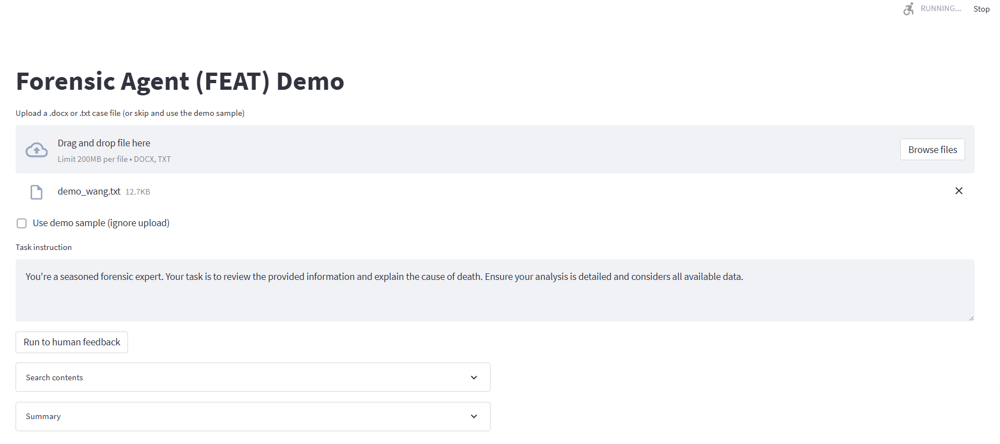
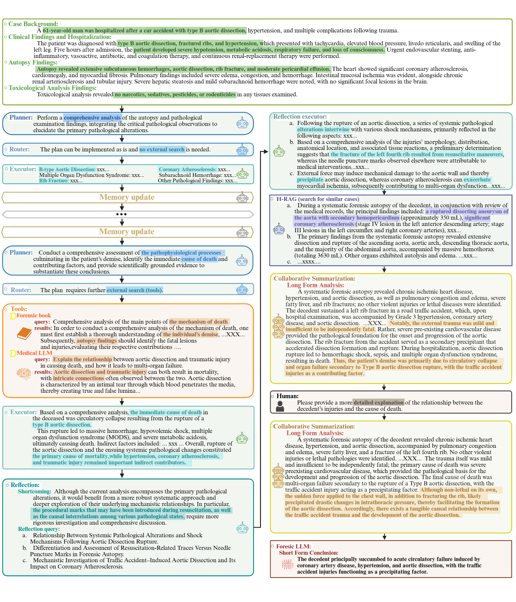

FEAT :monkey_face: 
===========  
[](http://arxiv.org/abs/2508.07950)

**FEAT 是一套模块化的多智能体架构，用于法医死因分析，可将异构输入转换为透明、可审计的结论。**  
*Planner（规划器）* 接收案件材料（基础人口学信息、病理解剖、毒理学、现场记录），执行自发现的任务分解，对子任务进行排序并路由至角色特定的 *Local Solvers（本地求解器）*。  
*Local Solvers* 采用工具增强的 ReAct 推理，为其负责的领域（如病理、毒理、临床史）生成中间发现与推理依据。  
*Reflection & Memory（反思与记忆）模块* 监控进度、批判性审阅输出、缓存证据，并通过迭代细化假设以减少误差传播。  
*Global Solver（全局求解器）* 基于经策划的中文法医学语料，结合本地微调的 LLM，利用分层式 RAG 整合各求解器输出，生成可溯源的长文分析与精炼的死因结论。

## FEAT：面向自动化死因分析、具域适配大语言模型的多智能体法医 AI 系统

<div align=center>

</div>

**FEAT 系统与数据概览。** (a) 六个评估队列（C1–C6）的类别构成。堆叠条显示各死因类别的百分比分布（右侧图例；左侧为队列病例数）。(b) 系统流程：(1) FEAT 接收多源材料。(2) Planner 将案件分解为层次化计划并针对实例自适应。(3) 由 Router 协同的 Local Solvers 按照 ReAct 循环，调用法医学教材/向量库、PubMed 检索、网站与医疗 LLM 等资源，生成以证据为基础的发现；Executor 汇总子任务结果。(4) Reflection & Memory 维护动态案卷，审计中间输出的完备性与一致性，遇到缺口或矛盾触发重规划——形成迭代闭环。(5) Global Solver 进行协同式摘要，并采用分层 RAG 检索相似案例与权威参考；在可选的人类审阅下，调用 Forensic-LLM 产出可用于法庭的结果：长格式分析与短格式结论。

## 👀 更新
* 2025/08/15：我们正在更新 FEAT 的代码仓库。

## 安装

**先决条件**：
```bash
python 3.11+
CUDA 12.4
pip
ANACONDA
```

激活虚拟环境后，按如下方式安装依赖：

```bash
## 第一步：安装 LLaMA-Factory
git clone --depth 1 https://github.com/hiyouga/LLaMA-Factory.git
cd LLaMA-Factory
pip install -e ".[torch,metrics]" --no-build-isolation

## 第二步：安装其他依赖（如 langchain 与 langgraph）
pip install -r requirements.txt
##
```

## 🚀 快速开始

<div align=center>

</div>

我们基于 Streamlit 开发了网页端界面，法医病理专家可便捷地使用。  
可参考 [README.md](https://github.com/shenxiaochenn/FEAT/blob/master/Agent_streamlit/README.md)。  
只需运行：

```bash
streamlit run streamlit_app.py
```

随后即可在浏览器中访问 FEAT，辅助分析法医案件：

```bash
Network URL: xxxxxxxxxxxxx
External URL: xxxxxxxxxxxxx
```

你只需上传相关信息，然后点击 **“run to human feedback”** 按钮，即可启动初步分析流程。系统会与您交互；若您对结果满意，系统将生成最终的长格式分析与短格式结论。  
注意：所有内容均可下载到本地，默认文件名为 `report.txt`。

你也可以通过命令行方式使用 FEAT：

```bash
cd Agent
python  feat_human_multi_replan.py --data_path xxx  --out_path xxx  ## 这将消耗更多费用！
## 或
python  feat_human_multi.py --data_path xxx  --out_path xxx
```

## 🔥 注意

在使用前，你需要完成以下准备工作：

1. 配置必要的密钥（必需）：
   ```python
   os.environ["LANGCHAIN_TRACING_V2"]="true"
   os.environ["LANGCHAIN_ENDPOINT"]="https://api.smith.langchain.com"
   os.environ["LANGCHAIN_API_KEY"]="lsv2_xxxxxxxxx"
   os.environ["LANGCHAIN_PROJECT"]="xxxxxxxxx"
   os.environ["OPENAI_API_KEY"] = "sk-xxxxxxxxx"
   os.environ["OPENAI_BASE_URL"] = "https:xxxxxxxxx"
   os.environ["DEEPSEEK_API_KEY"] = "sk-xxxxxxxxx"
   os.environ["TAVILY_API_KEY"] = "tvly-xxxxxxxxx"
   ```

2. 部署本地医疗大模型（我们已部署多个；你需要确保成功部署）：
   ```bash
   cd  llama_factory
   sh deepseek.sh   ### 我们微调的法医大模型（Forensic LLM）
   sh baichuan.sh   ### 医学知识模型
   ...              ## 其他工具模型（按需）
   ```

## 😁 演示

<div align=center>


**一个用于展示 FEAT 自动化死因分析工作流程的示例。**
</div>

## 🙏 致谢
本项目基于以下开源生态构建：  
[LangChain](https://github.com/langchain-ai/langchain)、[LangGraph](https://github.com/langchain-ai/langgraph)、[Langsmith](https://github.com/langchain-ai/langsmith-sdk) 与 [LLaMA-Factory](https://github.com/hiyouga/LLaMA-Factory)。

## ✉️ 联系方式
Email: chunfeng.lian@xjtu.edu.cn, wzy218@xjtu.edu.cn, 以及 shenxiaochen@stu.xjtu.edu.cn。欢迎交流！

---

## 📖 引用
若本工作对你的研究有帮助，请引用：
```bibtex
@article{shen2025feat,
  title={FEAT: A Multi-Agent Forensic AI System with Domain-Adapted Large Language Model for Automated Cause-of-Death Analysis},
  author={Shen, Chen and Zhang, Wanqing and Li, Kehan and Huang, Erwen and Bi, Haitao and Fan, Aiying and Shen, Yiwen and Dong, Hongmei and Zhang, Ji and Shao, Yuming and others},
  journal={arXiv preprint arXiv:2508.0795},
  year={2025},
}
```
